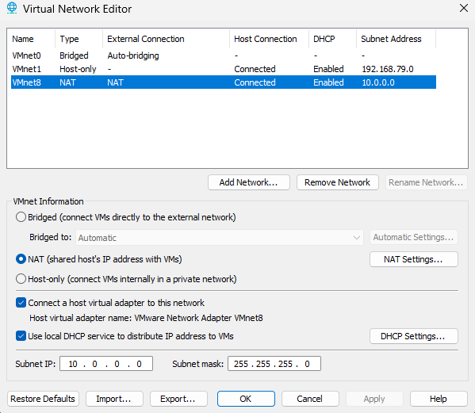
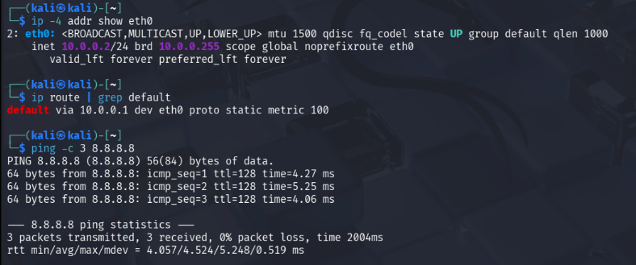
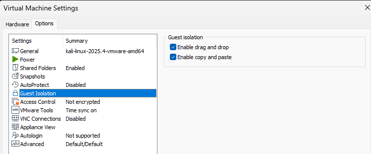
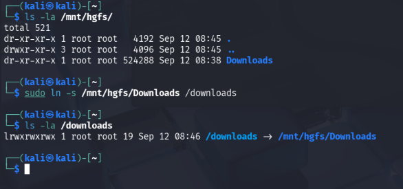
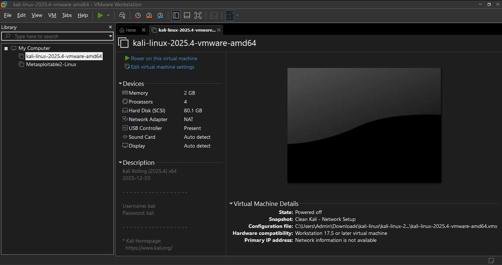

# Cybersecurity Lab Environment Setup

> **NetworkWalks Cybersecurity Internship — Week 1 | Project Module 1**

A controlled virtual cybersecurity lab configured with **VMware Workstation Pro 17** and **Kali Linux** for authorized security testing and future cybersecurity practice.

## Overview

This project documents the setup of a Kali Linux security-testing environment based on the NetworkWalks Week 1 lab requirements.

The lab uses a private **10.0.0.0/24** virtual network, with Kali configured at **10.0.0.2/24** and Internet connectivity verified through the VMware NAT gateway.

> **Implementation note:** The NetworkWalks task specifies VirtualBox. This implementation uses VMware Workstation because the Kali VM was already available in the existing VMware environment. The required network, connectivity, shared-folder, and snapshot objectives were configured and verified accordingly.

## Lab Configuration

| Component | Configuration |
|---|---|
| Hypervisor | VMware Workstation Pro 17 |
| Security VM | Kali Linux 2025.4 |
| VM Memory | 2 GB |
| VM Processors | 4 |
| Network Type | VMware NAT (VMnet8) |
| Network | `10.0.0.0/24` |
| Kali IP | `10.0.0.2/24` |
| Default Gateway | `10.0.0.1` |
| DNS | `8.8.8.8` |
| DHCP | Enabled on VMnet8 |
| Shared Folder | Windows `Downloads` |
| Kali Shared Path | `/downloads` |
| Snapshot | `Clean Kali - Network Setup` |

## Objectives

- Set up Kali Linux as the security-testing machine.
- Configure a private `10.0.0.0/24` virtual network.
- Assign Kali the static address `10.0.0.2/24`.
- Provide Internet connectivity through the virtual NAT gateway.
- Enable copy/paste and drag-and-drop between host and VM.
- Configure a shared Downloads directory.
- Create a clean VM snapshot as a recovery point.
- Document the completed environment for future cybersecurity exercises.

## Network Architecture

```text
                    Host Windows PC
                          |
                    VMware Workstation
                          |
                    VMnet8 — NAT
                     10.0.0.0/24
                          |
                    Gateway: 10.0.0.1
                          |
                    Kali Linux VM
                    10.0.0.2/24
                          |
                 Internet Connectivity
```

The `10.0.0.0/24` network provides a dedicated private addressing range for the lab while VMware NAT provides outbound Internet connectivity.

## Setup & Verification

### 1. Configure the Virtual Network

VMware **VMnet8** was configured as a NAT network with:

```text
Subnet:       10.0.0.0
Subnet Mask:  255.255.255.0
Gateway:      10.0.0.1
```



### 2. Configure Kali Linux Networking

Kali was assigned the required static IPv4 address:

```text
IP Address:   10.0.0.2/24
Gateway:      10.0.0.1
DNS:          8.8.8.8
```

Connectivity was verified from Kali:

```bash
ip -4 addr show eth0
ip route | grep default
ping -c 3 8.8.8.8
```

Result: **3/3 packets received with 0% packet loss.**



### 3. Enable Host–Guest Integration

VMware Guest Isolation was configured with:

- Copy and paste enabled
- Drag and drop enabled



### 4. Configure Shared Downloads Folder

The Windows Downloads directory was shared with the Kali VM.

```text
Windows:
C:\Users\Admin\Downloads

VMware share:
Downloads

Kali:
/downloads
```

The Kali path was linked to the VMware shared-folder mount:

```text
/downloads → /mnt/hgfs/Downloads
```



### 5. Create a Clean VM Snapshot

After completing the initial configuration, a baseline snapshot was created:

```text
Clean Kali - Network Setup
```

This provides a known-good recovery point before future cybersecurity experiments.



## Verification Summary

| Check | Result |
|---|---|
| Private network | `10.0.0.0/24` |
| Kali IPv4 | `10.0.0.2/24` |
| Default gateway | `10.0.0.1` |
| Gateway connectivity | Successful |
| Internet connectivity | Successful |
| Packet loss | 0% |
| Copy/paste | Enabled |
| Drag-and-drop | Enabled |
| Shared Downloads | Configured |
| Clean snapshot | Created |

## Key Takeaways

This setup provided practical experience with:

- Virtual machine networking
- NAT networking
- IPv4 addressing and subnetting
- Static IP configuration in Kali Linux
- Default gateways and DNS
- Host-to-guest file sharing
- VM snapshots and recovery
- Building a controlled environment for authorized security testing

## Security & Ethical Use

This environment is intended for **education and authorized security testing only**.

Security tools and testing activities should only be used against systems that you own or have explicit permission to test.

## Repository Structure

```text
NETWORKWALKS-WK1-PM1/
├── README.md
└── screenshots/
    ├── 01-nat-network.png
    ├── 02-kali-ip-connectivity.png
    ├── 03-guest-isolation.png
    ├── 04-shared-downloads.png
    └── 05-clean-kali-snapshot.png
```

## Program

**NetworkWalks Cybersecurity Internship**  
**Week 1 — Project Module 1: Cybersecurity Lab Setup**
